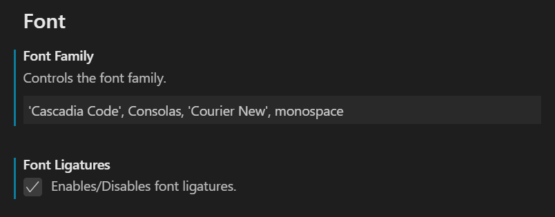
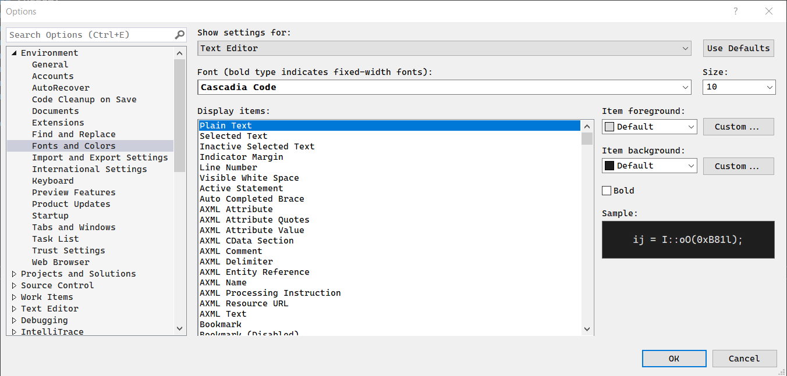
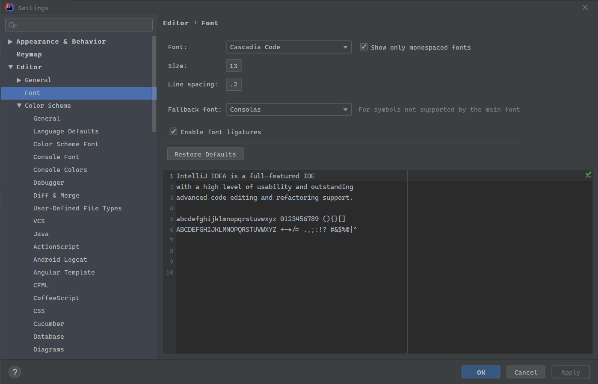

# Welcome!

This repository contains the source code of Cascadia Code.

Other related repositories include:

- [Windows Terminal](https://github.com/microsoft/terminal)

# Installation

**You can install the latest version of Cascadia Code from the releases page here:** https://github.com/microsoft/cascadia-code/releases

Clicking on the Cascadia.ttf file will download it to your machine. From there, open the file. This will open a new window displaying the characters included in the font along with the font displayed at different sizes. This window should have an "Install" button that will install the font on your machine when clicked.

👉 **Note:** If you have previously installed a version of Cascadia Code, please uninstall the previous version *prior* to installing a new version. Not doing so can result in improper rendering. 

# Contributing

This project welcomes contributions and suggestions. Most contributions require you to
agree to a Contributor License Agreement (CLA) declaring that you have the right to,
and actually do, grant us the rights to use your contribution. For details, visit
https://cla.microsoft.com.

When you submit a pull request, a CLA-bot will automatically determine whether you need
to provide a CLA and decorate the PR appropriately (e.g., label, comment). Simply follow the
instructions provided by the bot. You will only need to do this once across all repositories using our CLA.

# Getting Started

## Modifying the Font

The font is currently available as a (Unified Font Object) UFO + designspace file. This is a universal format that can be opened / exported from all major typeface design tools (Glyphs, Robofont, Fontlab VI, Fontforge). An understanding of [Microsoft VTT](https://docs.microsoft.com/en-us/typography/tools/vtt/) (Windows) and [FontTools](https://github.com/fonttools/fonttools) is also recommended for modification of the font's hinting. A Glyphs source is also provided in the 'releases' tab for your convenience. 

Please note that the hinting code is point order and glyph order specific. As a result, be aware that glyph modifications may require necessitate corrections to the hinting to ensure proper rendering. 


### Building the font from source

While the UFO can be edited and OTF / TTF exported directly from any of the aforementioned typeface design tools, you may want to build the font with hinting included, or with Nerd fonts integrated. This process requires the use of [Microsoft VTT](https://docs.microsoft.com/en-us/typography/tools/vtt/) (to compile the hints) and [FontTools](https://github.com/fonttools/fonttools).

1) Download the source code for Cascadia Code via the "download" button, or from the command line:
'git clone https://github.com/microsoft/cascadia-code.git'

2) Install [Python 3](https://realpython.com/installing-python/). If you're on a Windows machine, you may also need to install `pip`; [https://bootstrap.pypa.io/get-pip.py](https://bootstrap.pypa.io/get-pip.py)

3) While not necessary, we recommend creating a virtual environment

```
    # create new virtual environment called e.g. 'fonttools-venv', or anything you like
    python3 -m venv fonttools-venv

    # source the `activate` shell script to enter the environment (Un*x); to exit, just type `deactivate`
    . fonttools-venv/bin/activate

    # to activate the virtual environment in Windows `cmd.exe`, do
    fonttools-venv\Scripts\activate.bat
```

4) Install required font libraries. Navigate to the Cascadia Code folder downloaded in step 1. 

```
    pip3 install -r requirements.txt
    pip3 install git+https://github.com/daltonmaag/vttLib.git
```


5) Build the font from source:

```
    pip3 build.py sources
```

This will build the TTF font in the "build" folder. 

6) Open CascadiaCode.ttf in VTT. Select the "ship font" command to produce a compiled TTF font with the manual hints. 

Assuming everything has worked without issue, a new version of the font, "CascadiaCode-ship.ttf" should have been created in the same folder that is ready to go!


## Creating a Pull Request

At the moment, we do not have a testing framework for verifying proper character creation. When creating a pull request, please heavily document the steps you took along with images displaying your changes. Additionally, please provide images of the updated character(s) at different screen sizes to validate proper hinting.

## Communicating with the Team

The easiest way to communicate with the team is via GitHub issues. Please file new issues, feature requests and suggestions, but **DO search for similar open/closed pre-existing issues before you do**.

Please help us keep this repository clean, inclusive, and fun! We will not tolerate any abusive, rude, disrespectful or inappropriate behavior. Read our [Code of Conduct](https://opensource.microsoft.com/codeofconduct/) for more details.

If you would like to ask a question that you feel doesn't warrant an issue (yet), please reach out to us via Twitter:

Aaron Bell, Font Designer: [@aaronbell](https://twitter.com/aaronbell)

Kayla Cinnamon, Program Manager: [@cinnamon_msft](https://twitter.com/cinnamon_msft)

Rich Turner, Program Manager: [@richturn_ms](https://twitter.com/richturn_ms)

# Roadmap

This is the planned roadmap for Cascadia Code. Please be aware that the delivery dates are estimates and the features may arrive slightly earlier or later than predicted. This roadmap will continuously be updated as further features come along.

| Delivery Date | Feature | Description |
| ------------- | ------- | ----------- |
| November 2019 | Conversion of GitHub Pipeline/Workflow | Converting the GitHub pipeline to UFO to allow for users who don't have Macs to contribute to the source code. |
| November 2019 | Character Set Extensions | The addition of Greek, Cyrillic, and Vietnamese, and other characters to the main character set. |
| March 2020 | Weight Axis | Converting Cascadia Code into a variable font with milestone light and bold weights. |
| March 2020 | Arabic and Hebrew Characters | The addition of Arabic and Hebrew characters to the main character set. |

# Installing Cascadia Code in VS Code

1. Go to `File > Preferences` or hit `Ctrl + ,` in VS Code.
2. Enter "Font Face" in search field.
3. Enter following in Font Face option: `'Cascadia Code', Consolas, 'Courier New', monospace`.
4. Enable `Font Ligatures` option available just below 'Font Face'.
5. Press `Enter` and you're good to go.

> Note: If you've installed font and it does not get applied in VS Code, try restarting VS Code.



# Setting Cascadia Code in Visual Studio 2019

1. Go to `Tools > Options` in Visual Studio 2019.
2. Enter "Fonts and Colors" in search field or go to `Environment > Fonts and Colors`.
3. Select `Text Editor` in `Show settings for:`.
4. In the `Fonts` Dropdown select `Cascadia Code`.
5. Press `Ok` and you're good to go.

> Note: If you've installed the font and it does not get applied in Visual Studio 2019, try restarting Visual Studio 2019.

  

# Setting Cascadia Code in Windows Terminal (Preview)

1. Go to the Dropdown `Preferences` or hit `Ctrl + ,` in Windows Terminal (Preview).
2. Open the `profiles.json` in an editor like VS Code.
3. Scroll down to the `"profiles"` Property.
4. Look for your desired profile.
5. Change the `"fontFace"` attribute to `"fontFace": "Cascadia Code"`.

 Font Settings")

 Font Settings")

# Setting Cascadia Code in IntelliJ IDE 2019

1. Go to the Dropdown `File > Settings` or hit `Ctrl + Alt + S` in IntelliJ IDE 2019.
2. Enter "Appearance" in search field or go to `Editor > Font`.
4. Select `Cascadia Code` in the Dropdown.
5. Select Enable Font Ligatures
6. Press Ok and you're good to go.



# Code of Conduct

This project has adopted the [Microsoft Open Source Code of Conduct](https://opensource.microsoft.com/codeofconduct/). For more information see the [Code of Conduct FAQ](https://opensource.microsoft.com/codeofconduct/faq/)
or contact [opencode@microsoft.com](mailto:opencode@microsoft.com) with any additional questions or comments.
